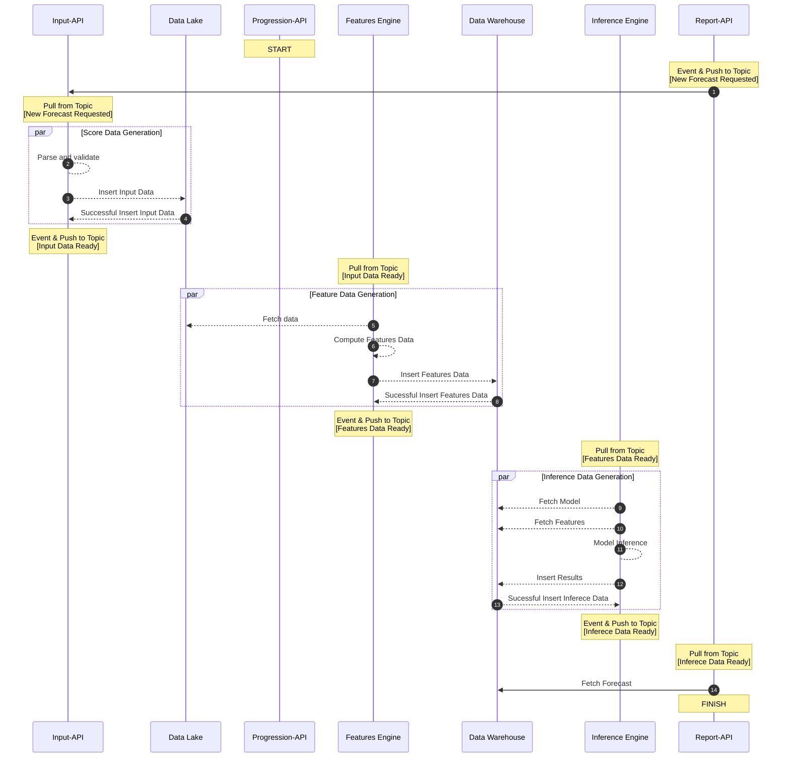

# Astronomer

Modules, Components and Artifacts for Cloud Terraforming

## PoC Event-Driven Architecture

```mermaid
sequenceDiagram
autonumber

participant Input-API as Input-API
participant DL as Data Lake
participant Progression-API as Progression-API
participant FE as Features Engine
participant DW as Data Warehouse
participant IE as Inference Engine

Note over Progression-API : START
Note over Report-API : Event & Push to Topic <br/> [New Forecast Requested]
Report-API ->> Input-API : 
Note over Input-API: Pull from Topic <br/> [New Forecast Requested]

par Score Data Generation
	Input-API --> Input-API: Parse and validate
	Input-API -->> DL: Insert Input Data
	DL -->> Input-API: Successful Insert Input Data
end

Note over Input-API: Event & Push to Topic <br/> [Input Data Ready]

Note over FE: Pull from Topic <br/> [Input Data Ready]
par Feature Data Generation
	FE -->> DL: Fetch data
	FE -->> FE: Compute Features Data
	FE -->> DW: Insert Features Data
	DW -->> FE: Sucessful Insert Features Data
end
Note over FE: Event & Push to Topic <br/> [Features Data Ready]

Note over IE: Pull from Topic <br/> [Features Data Ready]
par Inference Data Generation
	IE -->> DW: Fetch Model
	IE -->> DW: Fetch Features
	IE --> IE: Model Inference
	IE -->> DW: Insert Results
	DW -->> IE: Sucessful Insert Inferece Data
end
Note over IE: Event & Push to Topic <br/> [Inferece Data Ready]

Note over Report-API: Pull from Topic <br/> [Inferece Data Ready]
Report-API ->> DW: Fetch Forecast
Note over Report-API : FINISH
```

